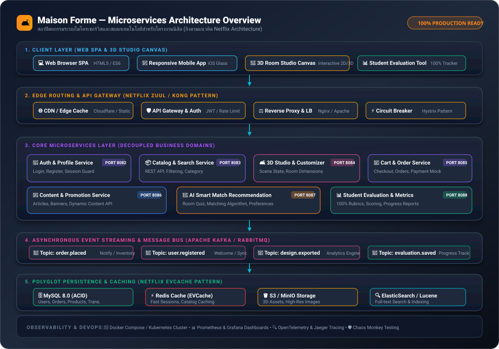
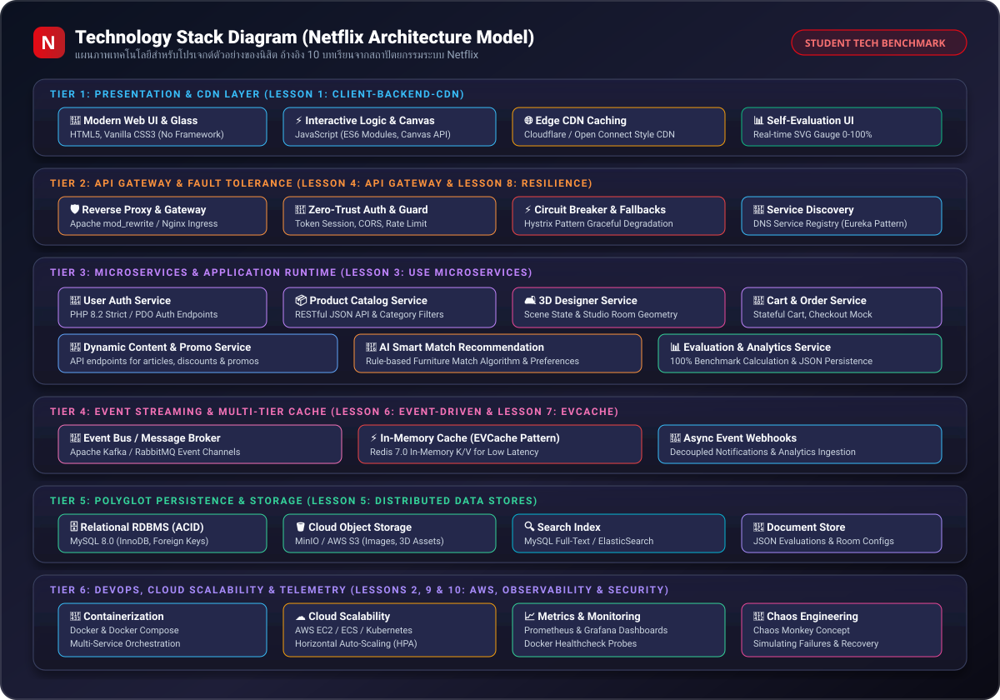

# 🛋️ Maison Forme - Furniture & Smart Home WebApp

ระบบเว็บแอปพลิเคชันร้านค้าและสตูดิโอออกแบบเฟอร์นิเจอร์ออนไลน์ (Maison Forme) พัฒนาด้วย PHP, MySQL, JavaScript (ES6) และ CSS Glassmorphism รองรับการใช้งานทั้งแบบ Local Server (XAMPP) และ **Docker Container** สำหรับรันบนเครื่องอื่นได้อย่างสะดวกรวดเร็ว

---

## 📁 โครงสร้างโฟลเดอร์โปรเจกต์ (Project Structure)

```
furniture-ai/
├── api/                         # Backend REST API (PHP Endpoints)
│   ├── content.php              # API ดึงเนื้อหาหน้าบริการ/โปรโมชั่น
│   ├── evaluation.php           # API บันทึก/ดึงข้อมูลประเมินผลงานตนเอง (0-100%)
│   ├── login.php                # API เข้าสู่ระบบผู้ใช้งาน
│   ├── logout.php               # API ออกจากระบบและเคลียร์ Session
│   ├── product.php              # API รายละเอียดสินค้ารายชิ้น
│   ├── products.php             # API ดึงรายการสินค้าทั้งหมด (JSON)
│   ├── profile.php              # API อัปเดตข้อมูลส่วนตัว
│   ├── register.php             # API สมัครสมาชิกใหม่
│   ├── search.php               # API ค้นหาสินค้าตามคีย์เวิร์ด
│   └── session.php              # API ตรวจสอบสถานะการ Login
│
├── assets/                      # Static Assets สำหรับหน้าเว็บ
│   ├── css/
│   │   └── style.css            # Stylesheet หลักและ Design Tokens
│   ├── js/                      # JavaScript ควบคุมฟังก์ชัน Client-side
│   │   ├── account.js           # เมนูโปรไฟล์ผู้ใช้
│   │   ├── auth.js              # ฟอร์ม Login / Register
│   │   ├── content.js           # ดึงเนื้อหาไดนามิก
│   │   ├── evaluation.js        # คำนวณคะแนน Rubrics 100% และจัดการ State
│   │   ├── guard.js             # ระบบล็อกสิทธิ์เข้าถึงหน้าที่ต้อง Login
│   │   ├── product_detail.js    # หน้าดูรายละเอียดสินค้า
│   │   ├── profile.js           # หน้าแก้ไขข้อมูลส่วนตัว
│   │   └── site.js              # ฟังก์ชันค้นหาและส่วนกลาง
│   └── images/                  # รูปภาพสินค้า แบนเนอร์ และแผนภาพสถาปัตยกรรม
│       ├── microservices_architecture.svg  # แผนภาพ Microservices Architecture
│       └── tech_stack_diagram.svg          # แผนภาพ Technology Stack (Netflix Model)
│
├── config/                      # การตั้งค่าระบบ
│   └── db.php                   # จุดเชื่อมต่อฐานข้อมูล PDO & MySQLi (รองรับทั้ง XAMPP และ Docker)
│
├── database/                    # สคริปต์ฐานข้อมูล
│   └── init.sql                 # SQL Schema & Seed Data (Docker รันสร้างฐานข้อมูลให้อัตโนมัติ)
│
├── docs/                        # เอกสารทางสถาปัตยกรรมและวิศวกรรมซอฟต์แวร์
│   ├── MICROSERVICES_ARCHITECTURE.md # เอกสารและแผนภาพ Microservices Architecture แบบละเอียด
│   └── TECH_STACK_DIAGRAM.md         # เอกสาร Technology Stack วิเคราะห์ 10 บทเรียนจาก Netflix
│
├── docker/                      # คอนฟิกสำหรับ Docker
│   ├── Dockerfile               # Base: php:8.2-apache + mysqli + pdo_mysql + rewrite
│   └── apache.conf              # Apache VirtualHost Configuration
│
├── [User Pages]                 # หน้าแสดงผลหลัก (Web Pages)
│   ├── index.php                # หน้าแรก (Glassmorphism + Slider + Featured Products)
│   ├── evaluation.html          # ระบบประเมินผลงานตนเองของนิสิต (100% Real-time Gauge)
│   ├── evaluation.php           # พอยต์เข้าสู่ระบบประเมินผลงานผ่าน PHP
│   ├── products.html            # แคตตาล็อกสินค้าทั้งหมด
│   ├── product_detail.html      # หน้ารายละเอียดสินค้า
│   ├── furniture-designer.php   # ระบบ The Perfect Match (Dynamic 3D Studio)
│   ├── furniture-designer.html  # หน้าสตูดิโอออกแบบ
│   ├── dashboard.html           # แผงควบคุมบัญชีผู้ใช้
│   ├── cart.html                # ตะกร้าสินค้า
│   ├── checkout.html            # สั่งซื้อและชำระเงิน
│   ├── history.html             # ประวัติการสั่งซื้อ
│   ├── profile.html             # บัญชีสมาชิก
│   ├── devices.html             # เครื่องมือออกแบบ
│   ├── promo.html               # โปรโมชั่น
│   ├── services.html            # บริการของเรา
│   ├── article.html             # บทความสาระน่ารู้
│   ├── search.html              # ผลการค้นหาสินค้า
│   ├── login.html               # เข้าสู่ระบบ
│   └── register.html            # สมัครสมาชิก
│
├── docker-compose.yml           # คำสั่งรัน Web + MySQL + phpMyAdmin ครบวงจร
├── .dockerignore                # กรองไฟล์ที่ไม่เกี่ยวข้องออกจาก Docker
├── .gitignore                   # กรองไฟล์สำหรับ Git
└── README.md                    # เอกสารคู่มือการติดตั้งและใช้งาน
```

---

## 🚀 วิธีเปิดใช้งานผ่าน Docker (แนะนำสำหรับเครื่องอื่น)

ข้อดี: **ไม่ต้องติดตั้ง PHP หรือ MySQL บนเครื่องเลย** เพียงมี [Docker Desktop](https://www.docker.com/products/docker-desktop/) ติดตั้งไว้

### ขั้นตอนการรันจาก GitHub:

1. **Clone โปรเจกต์ลงเครื่อง**:
   ```bash
   git clone https://github.com/67160360-AI/furniture-ai-webapp.git
   cd furniture-ai-webapp
   ```

2. **สั่งรันคอนเทนเนอร์ด้วย Docker Compose**:
   ```bash
   docker compose up -d
   ```
   *(Docker จะดาวน์โหลด Image, สร้างคอนเทนเนอร์ และรันไฟล์ `database/init.sql` เพื่อสร้างตารางและข้อมูลสินค้าเริ่มต้นให้อัตโนมัติทันที)*

3. **เข้าใช้งานผ่านเบราว์เซอร์**:
   - 🌐 **หน้าเว็บไซต์หลัก**: [http://localhost:8080](http://localhost:8080)
   - 🗄️ **phpMyAdmin จัดการฐานข้อมูล**: [http://localhost:8081](http://localhost:8081)
     - **Server**: `db`
     - **Username**: `root`
     - **Password**: `rootpassword`

4. **คำสั่งควบคุมอื่น ๆ**:
   - ดูสถานะคอนเทนเนอร์: `docker compose ps`
   - ดู Logs การทำงาน: `docker compose logs -f`
   - ปิดการทำงาน: `docker compose down`

---

## 💻 วิธีเปิดใช้งานผ่าน XAMPP (Local แบบเดิม)

หากต้องการรันผ่าน XAMPP โดยไม่ใช้ Docker:

1. นำโฟลเดอร์ `furniture-ai` ไปไว้ใน `C:\xampp\htdocs\`
2. เปิด **XAMPP Control Panel** แล้วกด **Start** ที่โมดูล **Apache** และ **MySQL**
3. เข้า [http://localhost/phpmyadmin](http://localhost/phpmyadmin)
4. สร้างฐานข้อมูลชื่อ `furniture_db` และนำเข้าไฟล์ `database/init.sql`
5. เข้าชมเว็บไซต์ผ่าน: [http://localhost/furniture-ai/](http://localhost/furniture-ai/)

---

## 🔒 ข้อมูลการเชื่อมต่อฐานข้อมูล (Database Credentials)

ไฟล์ [`config/db.php`](config/db.php) ได้รับการออกแบบให้ตรวจสอบสภาพแวดล้อมอัตโนมัติ:

| ตัวแปร Environment | ค่าเริ่มต้น (XAMPP) | ค่าเมื่อรันใน Docker |
|---|---|---|
| `DB_HOST` | `127.0.0.1` | `db` |
| `DB_PORT` | `3306` | `3306` |
| `DB_NAME` | `furniture_db` | `furniture_db` |
| `DB_USER` | `root` | `root` |
| `DB_PASS` | `""` (ว่าง) | `rootpassword` |

---

## 📊 ระบบประเมินผลงานตนเองของนิสิต (Student Self-Evaluation Tool 0-100%)

ระบบประเมินผลงานตนเองแบบ Interactive สำหรับนิสิตเพื่อวัดความก้าวหน้าและความสมบูรณ์ของโครงงานตามเกณฑ์มาตรฐานวิศวกรรมซอฟต์แวร์ 6 มิติ รวม 100%:

- 🌐 **เข้าใช้งานระบบประเมิน**: [evaluation.html](evaluation.html) หรือ [http://localhost:8080/evaluation.html](http://localhost:8080/evaluation.html)
- 📈 **คุณสมบัติหลัก**:
  - **Real-time Circular Gauge (0-100%)**: วงแหวนแสดงเปอร์เซ็นต์ความสำเร็จแบบแอนิเมชันพร้อมคำนวณเกรดและระดับความพร้อมของระบบ
  - **Checklist ครอบคลุม 6 มิติ (100 คะแนนเต็ม)**:
    1. ด้านข้อกำหนดและการวิเคราะห์ระบบ (15%)
    2. ด้านสถาปัตยกรรมไมโครเซอร์วิส (20%)
    3. ด้านประสบการณ์ผู้ใช้และฟรอนต์เอนด์ (20%)
    4. ด้าน RESTful APIs และการจัดการข้อมูล (20%)
    5. ด้าน DevOps คอนเทนเนอร์และคลาวด์ (15%)
    6. ด้านการทดสอบ ความปลอดภัย และการประเมินตนเอง (10%)
  - **ระบบบันทึกและส่งออก**: รองรับการบันทึกใน LocalStorage และ REST API (`/api/evaluation.php`), ส่งออกไฟล์รายงาน JSON และฟังก์ชันพิมพ์รายงานสรุป (Print/PDF) สำหรับส่งอาจารย์ผู้สอน

---

## 🏛️ สถาปัตยกรรมไมโครเซอร์วิส (Microservices Architecture)

โครงงานได้รับการออกแบบตามหลักการ **Microservices Architecture** เพื่อรองรับการขยายตัว (Scalability) และความทนทานต่อความล้มเหลว (Fault Tolerance)

📖 **เอกสารฉบับเต็ม**: [`docs/MICROSERVICES_ARCHITECTURE.md`](docs/MICROSERVICES_ARCHITECTURE.md)



### 7 โดเมนเซอร์วิสหลักของระบบ:
1. **Auth & Profile Service**: บริหารจัดการตัวตน, Session Guard, และโปรไฟล์ผู้ใช้
2. **Catalog & Search Service**: จัดการแคตตาล็อกสินค้า, การค้นหาแบบ Real-time และตัวกรอง
3. **3D Studio & Customizer**: สตูดิโอออกแบบจำลองห้อง 3 มิติ และการจัดวางเฟอร์นิเจอร์
4. **Cart & Order Service**: จัดการตะกร้าสินค้า, ระบบสั่งซื้อ, และประวัติการสั่งซื้อ
5. **Content & Promotion Service**: จัดการเนื้อหาข่าวสาร, บทความ, และโปรโมชั่น
6. **AI Smart Match Recommendation**: โมเดลปัญญาประดิษฐ์แนะนำสไตล์และเฟอร์นิเจอร์ที่ลงตัว
7. **Evaluation & Analytics Service**: ระบบประเมินผลงานโครงงานของนิสิต (0-100%) และส่งออกรายงาน

---

## 🛠️ Technology Stack Diagram (อ้างอิงบทเรียนจาก Netflix Architecture)

การออกแบบโครงสร้างเทคโนโลยีของโครงงานนี้ได้รับการสังเคราะห์และประยุกต์ใช้จากบทเรียนระดับโลก **[10 Things You Can Learn from Netflix's Architecture](https://dev.to/somadevtoo/10-things-you-can-learn-from-netflixs-architecture-1bnn)**

📖 **เอกสารฉบับเต็ม**: [`docs/TECH_STACK_DIAGRAM.md`](docs/TECH_STACK_DIAGRAM.md)



### 10 บทเรียนจาก Netflix ที่นำมาปรับใช้ในโครงงานนิสิต:
1. **Client-Backend-CDN Architecture**: แยกส่วน Presentation (HTML5/ES6), Backend REST APIs, และ Static Edge Caching ชัดเจน
2. **Cloud Scalability**: จัดเตรียม Docker Containerization พร้อมขยายตัวสู่ Cloud / Kubernetes
3. **Microservices Architecture**: แยกขอบเขตหน้าที่ตามโดเมนแบบ Loose Coupling
4. **API Gateway Pattern**: มีทางเข้าจุดเดียวพร้อม Reverse Proxy และ Session Guard
5. **Polyglot Persistence**: เลือกใช้ฐานข้อมูลตรงตามโจทย์ (MySQL สำหรับ ACID, Redis สำหรับแคช, JSON สำหรับการประเมิน)
6. **Event-Driven Architecture**: ออกแบบการสื่อสารแบบ Asynchronous เพื่อลดความหน่วง
7. **Multi-Tier Caching (EVCache Pattern)**: แคชข้อมูลทั้งฝั่งเบราว์เซอร์และฝั่งเซิร์ฟเวอร์
8. **Fault Tolerance & Circuit Breaker**: มี Fallback Strategy เมื่อเซอร์วิสใดเซอร์วิสหนึ่งขัดข้อง
9. **Observability & Health Probes**: รองรับ Docker Healthchecks และการติดตามระบบ
10. **Chaos Engineering Mindset**: พัฒนาแบบ Defensive Programming ป้องกันระบบล่มต่อเนื่อง

