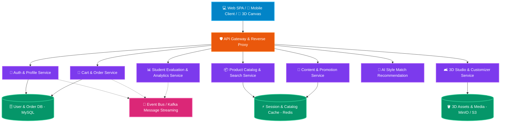
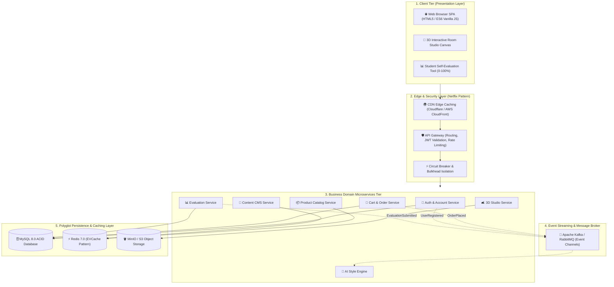
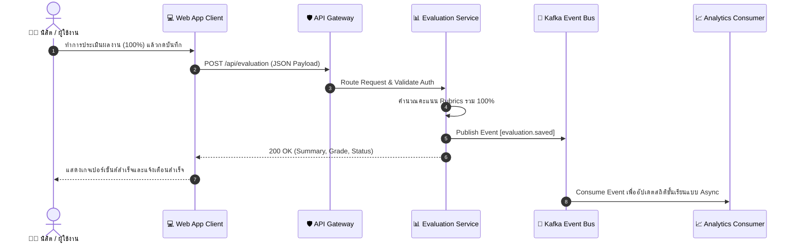
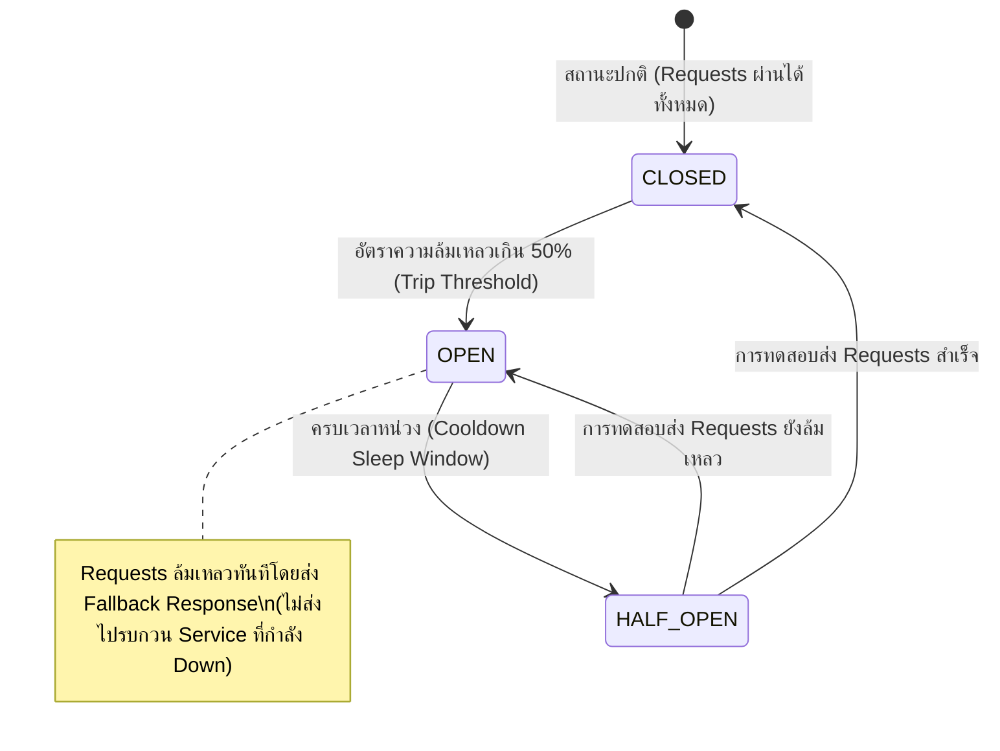

# 🏛️ สถาปัตยกรรมไมโครเซอร์วิส (Microservices Architecture)
## โครงการระบบเว็บแอปพลิเคชัน Maison Forme (Furniture & Smart Home Studio)

เอกสารนี้ระบุรายละเอียดสถาปัตยกรรมระดับองค์กร (Enterprise Architecture) รูปแบบ **Microservices Architecture** ที่ออกแบบสำหรับโครงการของนิสิต โดยถอดรหัสแบบจำลองสถาปัตยกรรมแบบกระจายศูนย์ (Distributed Systems) ระดับโลกที่ประสบความสำเร็จ เช่น **Netflix Architecture**


---

## 📑 สารบัญ (Table of Contents)
1. [ภาพรวมและความเป็นมา (Architecture Context)](#1-ภาพรวมและความเป็นมา-architecture-context)
2. [การวิเคราะห์แยกโดเมนเซอร์วิส (Service Decomposition)](#2-การวิเคราะห์แยกโดเมนเซอร์วิส-service-decomposition)
3. [แผนภาพสถาปัตยกรรมระบบรวม (High-Level Architecture Diagram)](#3-แผนภาพสถาปัตยกรรมระบบรวม-high-level-architecture-diagram)
4. [เกตเวย์และการเชื่อมต่อ (API Gateway & Service Ingress)](#4-เกตเวย์และการเชื่อมต่อ-api-gateway--service-ingress)
5. [การสื่อสารระหว่างเซอร์วิส (Inter-Service Communication & Event Bus)](#5-การสื่อสารระหว่างเซอร์วิส-inter-service-communication--event-bus)
6. [การจัดการข้อมูลแบบ Polyglot Persistence](#6-การจัดการข้อมูลแบบ-polyglot-persistence)
7. [การออกแบบความทนทานต่อความล้มเหลว (Fault Tolerance & Circuit Breaker)](#7-การออกแบบความทนทานต่อความล้มเหลว-fault-tolerance--circuit-breaker)
8. [การสังเกตการณ์ระบบและการตรวจสอบ (Observability & Telemetry)](#8-การสังเกตการณ์ระบบและการตรวจสอบ-observability--telemetry)
9. [การจัดวางและติดตั้งระบบ (Deployment & Container Topology)](#9-การจัดวางและติดตั้งระบบ-deployment--container-topology)

---

## 1. ภาพรวมและความเป็นมา (Architecture Context)

เดิมทีระบบทำงานในรูปแบบ **Modular Monolith** ซึ่งรวม Web Frontend, REST APIs และ Business Logic ไว้ใน Apache + PHP Container เดียวกัน แม้จะสะดวกต่อการพัฒนาในเฟสเริ่มต้น แต่เมื่อระบบมีผู้ใช้งานเพิ่มขึ้น หรือมีโมดูลคำนวณกราฟิก 3 มิติ และระบบปัญญาประดิษฐ์ (AI Recommendation) จำเป็นต้องยกระดับสู่ **Microservices Architecture** เพื่อให้ได้ประโยชน์ดังนี้:

- **Independent Scalability**: แยกขยายเซอร์วิสที่รับโหลดหนัก (เช่น Catalog Search และ 3D Studio) ได้อย่างอิสระโดยไม่ต้องขยายทั้งระบบ
- **Fault Isolation**: หากเซอร์วิสใดขัดข้อง (เช่น ระบบ AI หรือระบบประเมินผล) จะไม่ส่งผลให้ระบบหลัก (การค้นหาสินค้าและการสั่งซื้อ) หยุดชะงัก
- **Technology Freedom**: แต่ละเซอร์วิสสามารถเลือกใช้ภาษาและสแตกเทคโนโลยีที่เหมาะสมที่สุดกับโจทย์ของตน (Polyglot Programming)
- **Continuous Delivery**: แต่ละทีมสามารถ Deploy และทดสอบเซอร์วิสของตนเองได้อย่างรวดเร็ว

---

## 2. การวิเคราะห์แยกโดเมนเซอร์วิส (Service Decomposition)

ระบบแบ่งออกเป็น **7 โดเมนเซอร์วิสหลัก** ตามหลักการ Domain-Driven Design (DDD) และ Single Responsibility Principle:



### รายละเอียดหน้าที่ของแต่ละไมโครเซอร์วิส:

| เซอร์วิส (Microservice) | เทคโนโลยีหลัก | หน้าที่รับผิดชอบ | API Endpoints ตัวอย่าง |
|---|---|---|---|
| **1. Auth & Profile Service** | PHP 8.2 / JWT | ตรวจสอบตัวตน, Session Guard, โปรไฟล์ผู้ใช้ | `POST /api/login`, `POST /api/register`, `GET /api/session` |
| **2. Catalog & Search Service** | PHP 8.2 / Redis | แคตตาล็อกสินค้า, ค้นหาแบบ Real-time, หมวดหมู่ | `GET /api/products`, `GET /api/product/{id}`, `GET /api/search` |
| **3. 3D Studio & Customizer** | JS Canvas / WebGL | จัดการฉากห้อง 3 มิติ, พิกัดเฟอร์นิเจอร์, Render Preview | `POST /api/studio/scene`, `GET /api/studio/models` |
| **4. Cart & Order Service** | PHP 8.2 / MySQL | ตะกร้าสินค้า, เช็คเอาท์, ออกใบเสร็จ, ประวัติสั่งซื้อ | `POST /api/cart/add`, `POST /api/checkout`, `GET /api/orders` |
| **5. Content & Promotion** | PHP 8.2 / Markdown | จัดการข่าวสาร, บทความ, โปรโมชั่น, แบนเนอร์หน้าแรก | `GET /api/content?type=promo`, `GET /api/content?type=services` |
| **6. AI Recommendation** | Python / REST | แนะนำสไตล์แต่งบ้าน (Modern, Loft, Minimalist) | `POST /api/ai/match-style`, `GET /api/ai/recommendations` |
| **7. Evaluation & Analytics** | PHP / JSON Store | ระบบประเมินผลงานโครงงานของนิสิต (0-100%) และการส่งออกรายงาน | `GET /api/evaluation`, `POST /api/evaluation` |

---

## 3. แผนภาพสถาปัตยกรรมระบบรวม (High-Level Architecture Diagram)



---

## 4. เกตเวย์และการเชื่อมต่อ (API Gateway & Service Ingress)

สถาปัตยกรรมใช้ **API Gateway Pattern** (เช่นเดียวกับ Netflix Zuul และ Spring Cloud Gateway) ทำหน้าที่เป็นทางเข้าเดียว (Single Entry Point) สำหรับการสื่อสารภายนอกทั้งหมด:

1. **Request Routing & Path Rewriting**: กระจายคำขอจาก URL ไปยังไมโครเซอร์วิสปลายทางที่ถูกต้อง
2. **Authentication & Authorization**: ตรวจสอบ Session Token หรือ JWT ก่อนส่งต่อไปยัง Service ภายใน
3. **Cross-Origin Resource Sharing (CORS)**: จัดการ Header สิทธิ์การเข้าถึงจากโดเมนภายนอก
4. **Rate Limiting & Throttling**: ป้องกันการโจมตีแบบ DoS และป้องกัน Service รับภาระเกินกำลัง
5. **Response Aggregation**: รวมข้อมูลจากหลายเซอร์วิสเป็น Payload เดียวเพื่อลดรอบการเรียกของ Client (ลด Round-trip Latency)

---

## 5. การสื่อสารระหว่างเซอร์วิส (Inter-Service Communication & Event Bus)

ระบบรองรับการสื่อสาร 2 รูปแบบตามความจำเป็นของงาน:

### 5.1 Synchronous Communication (REST / JSON)
ใช้สำหรับการร้องขอข้อมูลแบบทันที (Request/Response) เช่น:
- Client สอบถามข้อมูลสินค้าผ่าน Catalog Service
- Cart Service ตรวจสอบสถานะผู้ใช้กับ Auth Service

### 5.2 Asynchronous Event-Driven Communication (Kafka / Event Bus)
ใช้สำหรับการประมวลผลเบื้องหลังโดยไม่ต้องให้ Client รอ (Decoupled & Non-blocking):
- **Event: `order.placed`** → Order Service ยิง Event ส่งต่อไปยัง Inventory Update, Email Confirmation และ AI Recommendation เพื่อปรับปรุงโมเดลความชอบของผู้ใช้
- **Event: `evaluation.saved`** → Evaluation Service ยิง Event สรุปคะแนนส่งต่อไปยัง Analytics Dashboard



---

## 6. การจัดการข้อมูลแบบ Polyglot Persistence

ตามแนวคิดของ Netflix สถาปัตยกรรมแบบกระจายศูนย์ที่ดีจะต้อง **ไม่ใช้ฐานข้อมูลเดียวสำหรับทุกอย่าง** (Database-per-Service Pattern):

1. **Relational Database (MySQL 8.0)**:
   - เหมาะกับข้อมูลที่ต้องการ ACID Transactions สูง เช่น บัญชีผู้ใช้งาน (`users`), รายการสั่งซื้อ (`orders`), และข้อมูลการประเมินผล
2. **In-Memory Cache (Redis Cluster - Netflix EVCache Pattern)**:
   - ใช้เก็บ Hot Data เช่น แคตตาล็อกสินค้าที่ถูกเปิดดูบ่อย, ตะกร้าสินค้าชั่วคราว, และ Session Tokens เพื่อให้อ่านข้อมูลได้ในระดับ Sub-millisecond
3. **Object Storage (MinIO / AWS S3)**:
   - ใช้เก็บไฟล์ Asset ขนาดใหญ่ เช่น ภาพถ่ายความละเอียดสูงของเฟอร์นิเจอร์, โมเดล 3 มิติ, และไฟล์ Exported PDF/JSON Reports

---

## 7. การออกแบบความทนทานต่อความล้มเหลว (Fault Tolerance & Circuit Breaker)

อิงตามบทเรียนของ Netflix (Netflix Hystrix & Resilience4j) ระบบนำเสนอกลไกป้องกันความล้มเหลวแบบต่อเนื่อง (Cascading Failure):



### Fallback Strategies สำหรับโปรเจกต์:
- **Product Catalog Down** → แสดงข้อมูลสินค้าจาก Local Storage Cache หรือสินค้าแนะนำชั่วคราว
- **AI Recommendation Down** → แสดงสินค้ายอดนิยม (Top Sellers) แทนคำแนะนำจากโมเดล AI
- **Evaluation API Down** → จัดเก็บข้อมูลลงใน LocalStorage อัตโนมัติ พร้อม Sync ย้อนหลังเมื่อระบบกลับมาออนไลน์

---

## 8. การสังเกตการณ์ระบบและการตรวจสอบ (Observability & Telemetry)

ระบบไมโครเซอร์วิสต้องการการตรวจสอบ 3 เสาหลัก (Three Pillars of Observability):

1. **Metrics (Prometheus & Grafana)**: วัดค่า Response Time, Request Count, Error Rate และ CPU/RAM Utilization
2. **Distributed Tracing (OpenTelemetry & Jaeger)**: ติดตามเส้นทางของ Request (Correlation ID / Trace ID) ข้ามผ่าน API Gateway ไปจนถึงฐานข้อมูล
3. **Centralized Logging (Loki / ELK Stack)**: รวบรวม Log จากคอนเทนเนอร์ทั้งหมดมาไว้ที่จุดศูนย์กลางเพื่อค้นหาสาเหตุของข้อผิดพลาดได้อย่างรวดเร็ว

---

## 9. การจัดวางและติดตั้งระบบ (Deployment & Container Topology)

ระบบพร้อมรันบนสภาพแวดล้อม Containerized ด้วย **Docker Compose** และสามารถขยายสู่ **Kubernetes (K8s)** ได้ทันที:

```yaml
# ตัวอย่างการกำหนดสถาปัตยกรรมใน docker-compose.yml
services:
  # 1. API Gateway & Web Interface
  web-gateway:
    build:
      context: .
      dockerfile: docker/Dockerfile
    ports:
      - "8080:80"
    environment:
      - DB_HOST=db
      - REDIS_HOST=redis
    depends_on:
      db:
        condition: service_healthy

  # 2. Database Service
  db:
    image: mysql:8.0
    ports:
      - "3307:3306"
    volumes:
      - db_data:/var/lib/mysql
      - ./database/init.sql:/docker-entrypoint-initdb.d/01_init.sql:ro
    healthcheck:
      test: ["CMD", "mysqladmin", "ping", "-h", "localhost", "-u", "root", "-prootpassword"]

  # 3. Cache Service (EVCache Pattern)
  redis:
    image: redis:7.0-alpine
    ports:
      - "6379:6379"

  # 4. Database Administration
  phpmyadmin:
    image: phpmyadmin/phpmyadmin:latest
    ports:
      - "8081:80"
    depends_on:
      db:
        condition: service_healthy
```

---

## 🎯 สรุปความพร้อมของโครงงานนิสิต

สถาปัตยกรรมไมโครเซอร์วิสที่จัดทำขึ้นนี้ ทำให้นิสิตมีแผนผังอ้างอิงระดับมาตรฐานวิศวกรรมซอฟต์แวร์สากล รองรับทั้งการนำเสนอในชั้นเรียน การประเมินตนเองตามเกณฑ์ 100% และการขยายระบบไปสู่ Production บนระบบคลาวด์ได้อย่างแท้จริง
