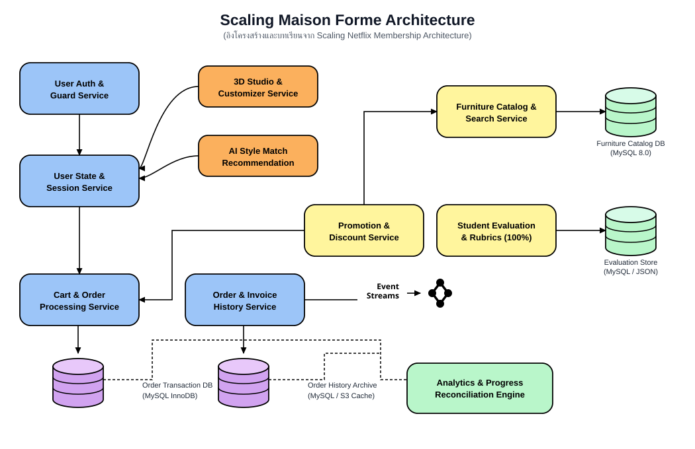
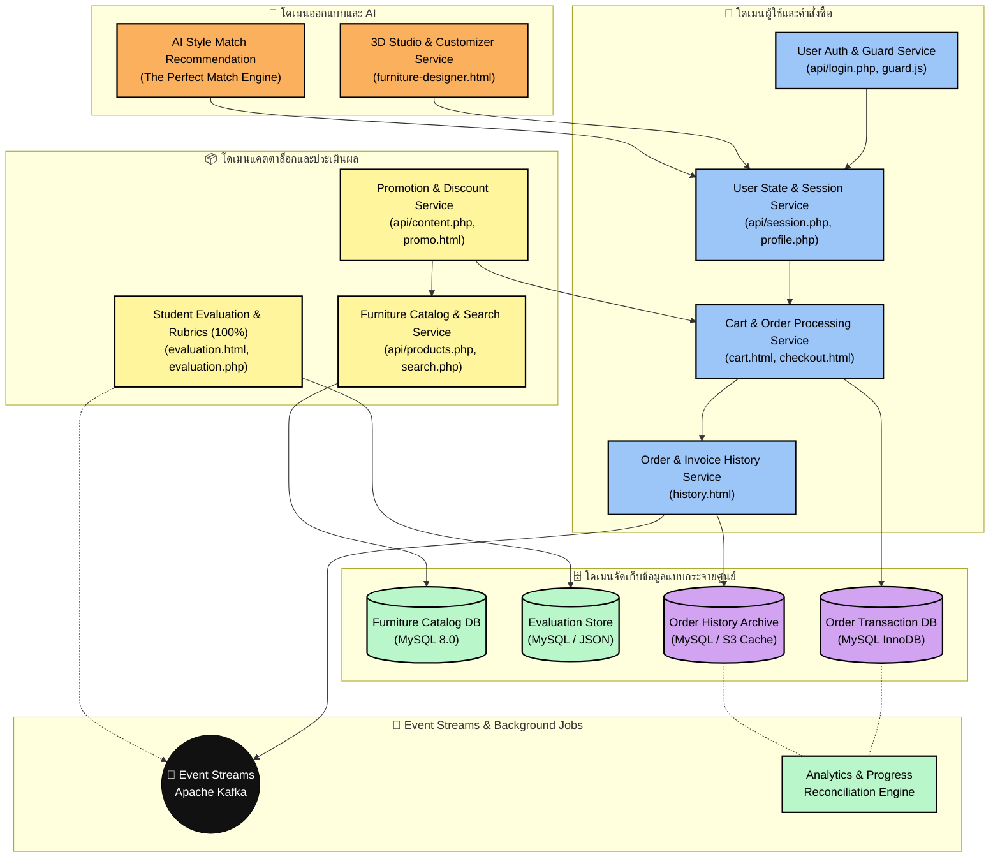

# 🏛️ สถาปัตยกรรมระบบ Maison Forme (Netflix Membership Model)
## การถอดแบบสถาปัตยกรรม Scaling Netflix Membership Architecture สู่โครงงานของนิสิต

เอกสารนี้แสดงการออกแบบแผนภาพสถาปัตยกรรมระบบ **Maison Forme — Furniture & Smart Home WebApp** โดยถอดแบบโครงสร้างการจัดวางองค์ประกอบ (Layout & Component Topology) จากแผนภาพต้นแบบ **Scaling Netflix Membership Architecture** เพื่อแสดงให้เห็นการไหลของข้อมูล (Data Flow) และการแบ่งหน้าที่ของแต่ละไมโครเซอร์วิสอย่างเป็นรูปธรรม

---

## 📑 สารบัญ (Table of Contents)
1. [ตารางเปรียบเทียบการแปลง Netflix สู่ Maison Forme](#1-ตารางเปรียบเทียบการแปลง-netflix-สู่-maison-forme)
2. [แผนภาพสถาปัตยกรรม Mermaid (Interactive Diagram)](#2-แผนภาพสถาปัตยกรรม-mermaid-interactive-diagram)
3. [ความเชื่อมโยงกับโค้ดและไฟล์จริงในโปรเจกต์ (Codebase Mapping)](#3-ความเชื่อมโยงกับโค้ดและไฟล์จริงในโปรเจกต์-codebase-mapping)
4. [เส้นทางการไหลของข้อมูล (Data Flow & Events)](#4-เส้นทางการไหลของข้อมูล-data-flow--events)
5. [การจัดการฐานข้อมูลและการกระทบยอดข้อมูล (Reconciliation Jobs)](#5-การจัดการฐานข้อมูลและการกระทบยอดข้อมูล-reconciliation-jobs)

---

## 1. ตารางเปรียบเทียบการแปลง Netflix สู่ Maison Forme

| กล่องในแผนภาพ Netflix | กล่องในระบบ Maison Forme | สี / หมวดหมู่ | โดเมนและหน้าที่รับผิดชอบ | ไฟล์หลักในโครงงาน |
|---|---|:---:|---|---|
| **Member Holds and Grace Service** | **User Auth & Guard Service** | 🔵 ฟ้า | ตรวจสอบสิทธิ์การเข้าใช้งาน, การล็อกอิน, Session Guard | [`api/login.php`](../api/login.php) [`assets/js/guard.js`](../assets/js/guard.js) |
| **Member State Management Service** | **User State & Session Service** | 🔵 ฟ้า | บริหารจัดการสถานะผู้ใช้, ข้อมูลโปรไฟล์, เซสชันแบบ Real-time | [`api/session.php`](../api/session.php) [`api/profile.php`](../api/profile.php) [`assets/js/account.js`](../assets/js/account.js) |
| **Member Bundle Service** | **3D Studio & Customizer Service** | 🟠 ส้ม | สตูดิโอออกแบบจำลองห้อง 3 มิติ จัดการพิกัดเฟอร์นิเจอร์ Canvas | [`furniture-designer.html`](../furniture-designer.html) [`furniture-designer.php`](../furniture-designer.php) |
| **Member App Store Service** | **AI Style Match Recommendation** | 🟠 ส้ม | ระบบแนะนำสไตล์แต่งบ้านอัจฉริยะ (The Perfect Match) | [`furniture-designer.html`](../furniture-designer.html) Rule Engine / AI Matcher |
| **Subscriptions Service** | **Cart & Order Processing Service** | 🔵 ฟ้า | ประมวลผลคำสั่งซื้อ, ตะกร้าสินค้า, เช็คเอาท์ และคำนวณยอดเงิน | [`cart.html`](../cart.html) [`checkout.html`](../checkout.html) |
| **Subscriptions History Service** | **Order & Invoice History Service** | 🔵 ฟ้า | เก็บบันทึกประวัติคำสั่งซื้อ, ใบเสร็จรับเงิน, ประวัติการชำระเงิน | [`history.html`](../history.html) Order History APIs |
| **Plan and Pricing Catalog Service** | **Furniture Catalog & Search Service** | 🟡 เหลือง | บริการค้นหาสินค้า, กรองหมวดหมู่, รายการเฟอร์นิเจอร์ทั้งหมด | [`api/products.php`](../api/products.php) [`api/search.php`](../api/search.php) [`products.html`](../products.html) |
| **Plan and Pricing DB (CockroachDB)** | **Furniture Catalog DB (MySQL 8.0)** | 🟢 ทรงกระบอกเขียว | ฐานข้อมูลเก็บรายการสินค้า, หมวดหมู่, ราคา และสต็อก | ตาราง `products` ใน [`database/init.sql`](../database/init.sql) |
| **Member Pricing Service** | **Promotion & Discount Service** | 🟡 เหลือง | ระบบคำนวณส่วนลด, โปรโมชั่นประจำเดือน, โค้ดส่วนลด | [`api/content.php`](../api/content.php) [`promo.html`](../promo.html) |
| **Code Redemptions Service** | **Student Evaluation & Rubrics (100%)** | 🟡 เหลือง | ระบบประเมินผลงานตนเองของนิสิต คำนวณเกรด และ Progress Bar | [`api/evaluation.php`](../api/evaluation.php) [`assets/js/evaluation.js`](../assets/js/evaluation.js) [`evaluation.html`](../evaluation.html) |
| **Code Redemptions DB (CockroachDB)** | **Evaluation Store (MySQL / JSON)** | 🟢 ทรงกระบอกเขียว | จัดเก็บข้อมูลคะแนน Rubrics 100%, ประวัติการประเมิน | [`database/evaluation_data.json`](../database/evaluation_data.json) ตาราง `student_evaluations` |
| **Subscription DB (Cassandra)** | **Order Transaction DB (MySQL InnoDB)** | 🟣 ทรงกระบอกม่วง | เก็บรายการคำสั่งซื้อที่เกิดขึ้นแบบ ACID Transactions | ตาราง `orders`, `order_items` |
| **Subscription History (Cassandra)** | **Order History Archive (MySQL / S3)** | 🟣 ทรงกระบอกม่วง | คลังจัดเก็บข้อมูลประวัติคำสั่งซื้อระยะยาวและใบเสร็จ | ตาราง `order_history` |
| **Event Streams (Kafka)** | **Event Streams (Kafka / Event Bus)** | ⚫ สัญลักษณ์ Kafka | ช่องทางกระจาย Event เช่น `order.placed`, `evaluation.saved` | Asynchronous Event Channels |
| **Apache Spark Powered Offline Jobs** | **Analytics & Progress Reconciliation** | 🟢 เขียวอ่อน | งานประมวลผลเบื้องหลัง สรุปสถิติความก้าวหน้านิสิตและคำสั่งซื้อ | Background Analytics Engine |

---

## 2. แผนภาพสถาปัตยกรรม Mermaid (Interactive Diagram)

---

## 3. ความเชื่อมโยงกับโค้ดและไฟล์จริงในโปรเจกต์ (Codebase Mapping)

### 3.1 กลุ่มบริการผู้ใช้งาน (Blue Nodes)
- **User Auth & Guard Service**: ดูแลความปลอดภัยในการเข้าสู่ระบบ ผ่าน [`api/login.php`](../api/login.php), [`api/register.php`](../api/register.php) และมี [`assets/js/guard.js`](../assets/js/guard.js) เป็นตัวคอยดักสิทธิ์การเข้าถึงหน้าที่ต้องเป็นสมาชิก
- **User State & Session Service**: บริหารเซสชันผู้ใช้งาน [`api/session.php`](../api/session.php) ซิงค์ข้อมูลข้ามหน้าร้านค้าและแดชบอร์ด [`dashboard.html`](../dashboard.html)
- **Cart & Order Processing Service**: จัดการสินค้าในตะกร้า คำนวณภาษี/ค่าจัดส่ง ผ่าน [`cart.html`](../cart.html) และเช็คเอาท์ [`checkout.html`](../checkout.html)
- **Order & Invoice History Service**: แสดงใบเสร็จและรายการสั่งซื้อย้อนหลังใน [`history.html`](../history.html)

### 3.2 กลุ่มบริการออกแบบและปัญญาประดิษฐ์ (Orange Nodes)
- **3D Studio & Customizer Service**: สตูดิโอออกแบบ 3 มิติใน [`furniture-designer.html`](../furniture-designer.html) ให้นิสิตและผู้ใช้ทดลองจัดวางเฟอร์นิเจอร์ ปรับขนาด และจับคู่สี
- **AI Style Match Recommendation**: ระบบควิซประเมินไลฟ์สไตล์ (Minimal, Luxury, Modern Loft) เพื่อเลือกเฟอร์นิเจอร์ชิ้นที่ "แมตช์" ที่สุด

### 3.3 กลุ่มบริการแคตตาล็อก โปรโมชั่น และระบบประเมินตนเอง (Yellow Nodes)
- **Furniture Catalog & Search Service**: ให้บริการ API ดึงรายการสินค้า [`api/products.php`](../api/products.php) และค้นหาแบบ Real-time [`api/search.php`](../api/search.php)
- **Promotion & Discount Service**: จัดการแคมเปญส่วนลดและบทความแต่งบ้าน [`api/content.php`](../api/content.php), [`promo.html`](../promo.html)
- **Student Evaluation & Rubrics (100%)**: ระบบประเมินผลงานโครงงานของนิสิต [`evaluation.html`](../evaluation.html), [`api/evaluation.php`](../api/evaluation.php) คำนวณคะแนนเกณฑ์ 6 มิติรวม 100% เต็ม

---

## 4. เส้นทางการไหลของข้อมูล (Data Flow & Events)

1. **Synchronous REST Flow**:
   - ผู้ใช้เปิดหน้าเว็บ $\rightarrow$ ร้องขอข้อมูลสินค้าผ่าน `Furniture Catalog Service` $\rightarrow$ อ่านจาก `Catalog Database`
   - ผู้ใช้สั่งซื้อสินค้า $\rightarrow$ `User State Service` ส่งข้อมูลไปยัง `Cart & Order Service` $\rightarrow$ บันทึกลงใน `Order Transaction Database (ACID)`
2. **Asynchronous Event-Driven Flow (Kafka)**:
   - เมื่อเกิดเหตุการณ์สำคัญ (เช่น มีคำสั่งซื้อใหม่ หรือนิสิตกดบันทึกผลการประเมิน 100%)
   - ข้อมูลจะถูก Publish ไปยัง **Event Streams (Apache Kafka)**
   - ข้อมูลจะไหลต่อไปยัง `Analytics & Progress Reconciliation Engine` เพื่ออัปเดตสถิติโดยไม่ต้องให้ผู้ใช้หน้าเว็บต้องรอ (Non-blocking)

---

## 5. การจัดการฐานข้อมูลและการกระทบยอดข้อมูล (Reconciliation Jobs)

ตามแนวคิดของ Netflix ในรูปต้นแบบ:
- **Green Cylinders (Relational / Catalog DB)**: ใช้เก็บข้อมูลที่เป็น Master Data เช่น สินค้า (`products`) และเกณฑ์ประเมิน (`student_evaluations`)
- **Purple Cylinders (Transactional / Historical DB)**: ใช้เก็บข้อมูล Transaction ที่เกิดขึ้นต่อเนื่อง เช่น คำสั่งซื้อ (`orders`) และประวัติการทำรายการ (`order_history`)
- **Offline Reconciliation Jobs (เส้นประ)**: มีหน้าที่ตรวจสอบความถูกต้องของข้อมูลระหว่าง Order DB และ History Archive ย้อนหลัง เพื่อให้มั่นใจว่าข้อมูลทั้งสองฝั่งสอดคล้องกัน 100% (Eventual Consistency)
