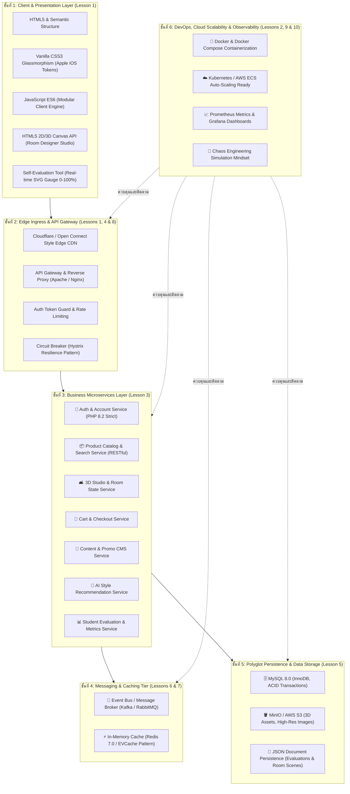

# 🛠️ Technology Stack Diagram & System Design Analysis
## ถอดบทเรียนสถาปัตยกรรมระดับโลกของ Netflix สู่โครงงานนิสิตตัวอย่าง

เอกสารนี้จัดทำขึ้นเพื่อวิเคราะห์และแสดงแผนภาพ **Technology Stack Diagram** สำหรับโครงงานเว็บแอปพลิเคชันตัวอย่างของนิสิต (**Maison Forme — Furniture & Smart Home WebApp**) โดยสังเคราะห์องค์ความรู้จากบทความ [10 Things You Can Learn from Netflix’s Architecture](https://dev.to/somadevtoo/10-things-you-can-learn-from-netflixs-architecture-1bnn) เพื่อเป็นแนวทางให้นิสิตเข้าใจหลักการออกแบบระบบขนาดใหญ่ (System Design & Distributed Systems)

---

## 📑 สารบัญ (Table of Contents)
1. [บทนำและความเชื่อมโยงกับ Netflix Architecture](#1-บทนำและความเชื่อมโยงกับ-netflix-architecture)
2. [แผนภาพ Technology Stack Diagram ตามสถาปัตยกรรมแบบเลเยอร์](#2-แผนภาพ-technology-stack-diagram-ตามสถาปัตยกรรมแบบเลเยอร์)
3. [การถอดรหัส 10 บทเรียนจาก Netflix สู่โครงงานของนิสิต](#3-การถอดรหัส-10-บทเรียนจาก-netflix-สู่โครงงานของนิสิต)
4. [ตารางสรุปเทคโนโลยีและเครื่องมือในแต่ละชั้น (Tech Stack Matrix)](#4-ตารางสรุปเทคโนโลยีและเครื่องมือในแต่ละชั้น-tech-stack-matrix)
5. [แนวทางการประเมินความพร้อมและการต่อยอดโครงงาน](#5-แนวทางการประเมินความพร้อมและการต่อยอดโครงงาน)

---

## 1. บทนำและความเชื่อมโยงกับ Netflix Architecture

Netflix ให้บริการสตรีมมิ่งแก่ผู้ใช้งานกว่า 250 ล้านคนทั่วโลกโดยไม่มีสะดุด ความสำเร็จนี้ไม่ได้เกิดขึ้นจากเทคโนโลยีใดเทคโนโลยีหนึ่งโดดๆ แต่เกิดจาก **รูปแบบสถาปัตยกรรม (Architectural Patterns)** ที่ถูกออกแบบมาอย่างรอบคอบ

สำหรับโครงงานของนิสิต แม้จะมีขนาดเริ่มต้นที่กะทัดรัด แต่การวางรากฐานทางสถาปัตยกรรมโดยเลียนแบบ Best Practices ของ Netflix จะช่วยให้นิสิต:
- เขียนโค้ดอย่างเป็นระเบียบ ไม่ปะปน Logic ระหว่าง Presentation, API และ Database
- ออกแบบระบบที่สามารถสเกล (Horizontal Scalability) เมื่อมีผู้ใช้และข้อมูลเพิ่มขึ้น
- มีความเข้าใจลึกซึ้งเกี่ยวกับการจัดการ Distributed State, Caching, และ Resilience

---

## 2. แผนภาพ Technology Stack Diagram ตามสถาปัตยกรรมแบบเลเยอร์

---

## 3. การถอดรหัส 10 บทเรียนจาก Netflix สู่โครงงานของนิสิต

อ้างอิงจากบทความ [10 Things You Can Learn from Netflix’s Architecture](https://dev.to/somadevtoo/10-things-you-can-learn-from-netflixs-architecture-1bnn) ดังนี้:

### บทเรียนที่ 1: Client-Backend-CDN Architecture (การแยกความรับผิดชอบ 3 ฝ่าย)
- **แนวคิดของ Netflix**: แบ่งระบบออกเป็น 3 องค์ประกอบหลักชัดเจน คือ Client (TV/Web/Mobile), Backend (AWS Microservices) และ CDN (Open Connect)
- **การประยุกต์ใช้ในโครงงาน**:
  - **Client**: หน้าบ้านทำงานเป็น Single Page Experience / Clean HTML5 + ES6 แยกขาดจาก Backend ไม่มีการปะปน Business Logic ใน View
  - **Backend**: สื่อสารผ่าน RESTful JSON API เท่านั้น (`/api/products.php`, `/api/evaluation.php`)
  - **CDN & Edge**: จัดเก็บ Static Assets เช่น ภาพเฟอร์นิเจอร์ โมเดล 3D และ CSS สไตล์ชีต ไว้ที่ Edge Layer หรือแคชบนเบราว์เซอร์

### บทเรียนที่ 2: Use Cloud/AWS for Backend Scalability (ความยืดหยุ่นและการสเกลบนคลาวด์)
- **แนวคิดของ Netflix**: ใช้คลาวด์เพื่อให้ระบบสามารถขยายตัว (Elasticity) เพิ่มเครื่องในเวลาที่มีคนดูเยอะ และลดเครื่องในเวลาที่มีคนดูน้อย
- **การประยุกต์ใช้ในโครงงาน**:
  - จัดทำคอนฟิกคอนเทนเนอร์ด้วย **Docker** และ **Docker Compose** ทำให้โครงงานของนิสิตสามารถนำไป Deploy บน Cloud Provider ใดก็ได้ (AWS ECS, Google Cloud Run, DigitalOcean) ด้วยคำสั่งเดียว `docker compose up -d`

### บทเรียนที่ 3: Use Microservices Architecture (การแบ่งระบบเป็นไมโครเซอร์วิสย่อย)
- **แนวคิดของ Netflix**: มีไมโครเซอร์วิสกว่า 700 ตัว ทำงานอิสระ ไม่ผูกมัดกัน
- **การประยุกต์ใช้ในโครงงาน**:
  - แยกโครงสร้างโค้ดออกเป็น 7 โดเมนเซอร์วิส (Auth, Catalog, 3D Studio, Cart, Content, AI Matcher, Evaluation) แต่ละ Service มี Contract ผ่าน REST API ที่ชัดเจน

### บทเรียนที่ 4: API Gateway Pattern (การมีเกตเวย์รับคำขอจุดเดียว)
- **แนวคิดของ Netflix**: ใช้ Zuul / Federated GraphQL Gateway จัดการ Routing, Security, และ Rate Limiting
- **การประยุกต์ใช้ในโครงงาน**:
  - ใช้ Apache VirtualHost พร้อม `mod_rewrite` ทำหน้าที่เป็น API Gateway รับทุก Request แล้วกระจายไปยัง Endpoint ภายใน พร้อมระบบ Guard (`guard.js`) ป้องกันหน้าที่ต้องยืนยันตัวตน

### บทเรียนที่ 5: Polyglot & Distributed Data Stores (เลือกฐานข้อมูลให้เหมาะกับงาน)
- **แนวคิดของ Netflix**: ไม่พึ่งพาฐานข้อมูลชนิดเดียว ใช้ทั้ง Cassandra, DynamoDB, MySQL
- **การประยุกต์ใช้ในโครงงาน**:
  - **MySQL 8.0**: เก็บข้อมูลที่มีความสัมพันธ์สูง (ผู้ใช้, คำสั่งซื้อ, สินค้า)
  - **In-Memory Cache (Redis)**: แคชข้อมูลที่ถูกอ่านบ่อย
  - **JSON Storage**: จัดเก็บข้อมูลสถานะห้อง 3 มิติ และผลการประเมินโครงงาน (Evaluation Rubrics)

### บทเรียนที่ 6: Event-Driven Messaging Architecture (การสื่อสารด้วย Event แบบ Asynchronous)
- **แนวคิดของ Netflix**: ใช้ Apache Kafka ในการส่งข้อมูลสตรีมมิ่งและ Event ข้ามระบบ
- **การประยุกต์ใช้ในโครงงาน**:
  - นิสิตออกแบบให้ระบบการสั่งซื้อ (Order Placed) และการส่งผลประเมิน (Evaluation Saved) ทำงานผ่าน Event Channels แบบไม่บล็อกการทำงานของผู้ใช้

### บทเรียนที่ 7: Multi-Tier Caching Strategy (EVCache Pattern)
- **แนวคิดของ Netflix**: สร้าง EVCache (ขึ้นอยู่กับ Memcached/Redis) เพื่อลดการยิง Query ซ้ำซ้อนลงฐานข้อมูล
- **การประยุกต์ใช้ในโครงงาน**:
  - ฝั่ง Client ใช้ `localStorage` และ `sessionStorage` สำหรับตะกร้าสินค้าและผลการประเมิน
  - ฝั่ง Server ใช้ Query Caching และ Header Cache-Control สำหรับข้อมูลสินค้า

### บทเรียนที่ 8: Resilience & Circuit Breakers (ความทนทานต่อความล้มเหลว)
- **แนวคิดของ Netflix**: พัฒนาเครื่องมืออย่าง Hystrix เพื่อตัดวงจร (Circuit Break) เมื่อ Service ปลายทางมีปัญหา
- **การประยุกต์ใช้ในโครงงาน**:
  - เมื่อ API หลังบ้านขัดข้อง หน้าเว็บมี Graceful Degradation และ Fallback แสดงผล เช่น ระบบประเมินผลงานยังสามารถคำนวณและบันทึกใน LocalStorage ได้อย่างราบรื่น

### บทเรียนที่ 9: Observability & Distributed Tracing (การตรวจวัดและสังเกตการณ์ระบบ)
- **แนวคิดของ Netflix**: ติดตาม Metric, Latency, และ Logs ข้ามทุกไมโครเซอร์วิส
- **การประยุกต์ใช้ในโครงงาน**:
  - ใช้งาน Docker Healthcheck Probes (`mysqladmin ping`) เพื่อตรวจสอบความสมบูรณ์ของ Service แบบอัตโนมัติ พร้อมทั้งเตรียมช่องทางเชื่อมต่อ Prometheus/Grafana

### บทเรียนที่ 10: Chaos Engineering & Security (การจำลองข้อผิดพลาดและความปลอดภัย)
- **แนวคิดของ Netflix**: คิดค้น Chaos Monkey เพื่อสุ่มปิดเซอร์วิสบน Production เพื่อทดสอบความทนทาน
- **การประยุกต์ใช้ในโครงงาน**:
  - นิสิตสามารถทดสอบปิด Container ตัวใดตัวหนึ่ง (เช่น ปิด MySQL หรือปิด Web) เพื่อทดสอบว่าหน้าเว็บแสดง Error Message ที่เข้าใจง่ายและไม่พังทั้งระบบ (Defensive Programming)

---

## 4. ตารางสรุปเทคโนโลยีและเครื่องมือในแต่ละชั้น (Tech Stack Matrix)

| ชั้นสถาปัตยกรรม (Layer) | เทคโนโลยีที่เลือกใช้ (Technology Choice) | เหตุผลความเหมาะสม (Rationale) |
|---|---|---|
| **Frontend Framework** | HTML5, Vanilla JavaScript (ES6 Modules) | โหลดเร็วระดับมิลลิวินาที ไม่มีปัญหา Dependency Bloat ควบคุม DOM ได้ 100% |
| **CSS & Design System** | Vanilla CSS3 + Apple iOS Glassmorphism | ประสบการณ์ผู้ใช้หรูหราทันสมัย เบลอพื้นหลังโปร่งใส (Backdrop-filter) โทนสี Amber/Copper |
| **3D & Canvas Engine** | HTML5 Canvas 2D Context & WebGL Ready | คำนวณพิกัดการจัดวางเฟอร์นิเจอร์ในห้อง 3 มิติได้อย่างลื่นไหล 60 FPS |
| **API & Backend** | PHP 8.2 (Strict Typing, PDO Prepared Statements) | ประสิทธิภาพสูง เสถียร รองรับทั้ง XAMPP ท้องถิ่นและคอนเทนเนอร์บน Cloud |
| **Database** | MySQL 8.0 (InnoDB Engine, utf8mb4) | ACID Transactions สมบูรณ์ รองรับคีย์นอกและการทำ Indexing |
| **Caching Layer** | Redis 7.0 & Browser LocalStorage | ลด Latency ของฐานข้อมูล แคชเซสชันและผลการประเมินของนิสิต |
| **Container & DevOps** | Docker, Dockerfile, Docker Compose | สภาพแวดล้อมเหมือนกันทุกเครื่อง (Reproducible Environment) รันได้ทันที |
| **Evaluation System** | Custom Interactive Rubrics (100% Benchmark) | รองรับการประเมินตนเองของนิสิต คำนวณเปอร์เซ็นต์แบบ Real-time และส่งออกรายงาน |

---

## 5. แนวทางการประเมินความพร้อมและการต่อยอดโครงงาน

นิสิตสามารถนำแผนภาพ Technology Stack Diagram และข้อคิดจากสถาปัตยกรรมของ Netflix นี้ไปใช้ในการ:
1. **ประเมินความสมบูรณ์ของโครงงานในหน้าระบบประเมินผลงาน (`evaluation.html`)**: ให้คะแนนตนเองตามเกณฑ์ 100%
2. **นำเสนอผลงาน (Project Defense / Presentation)**: แสดงให้เห็นว่าโครงงานถูกออกแบบตามหลักวิศวกรรมซอฟต์แวร์ระดับสากล ไม่ใช่เพียงเว็บแอปพลิเคชันธรรมดา
3. **ต่อยอดสู่ระบบคลาวด์ในอนาคต**: นำ Docker Compose ไปแปลงเป็น Helm Chart หรือ Kubernetes Manifests สำหรับการ Deploy บน AWS/GCP
